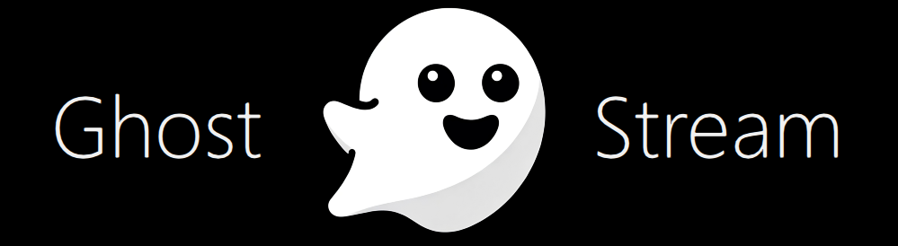
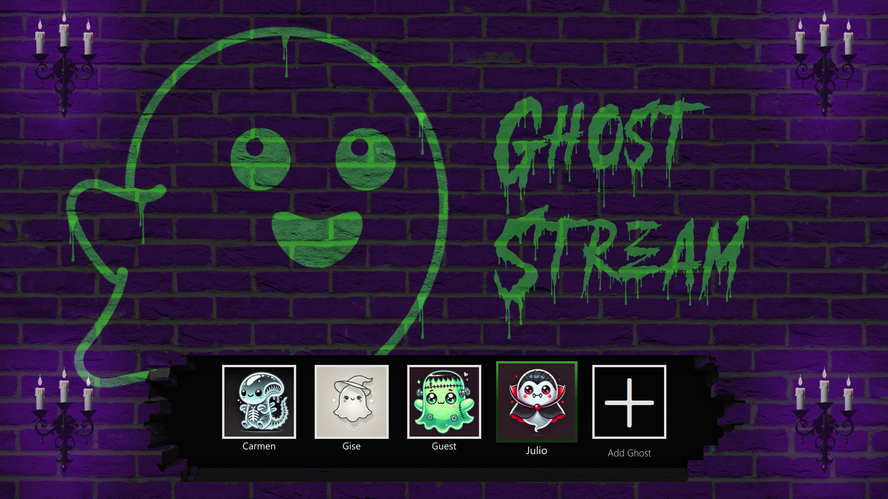
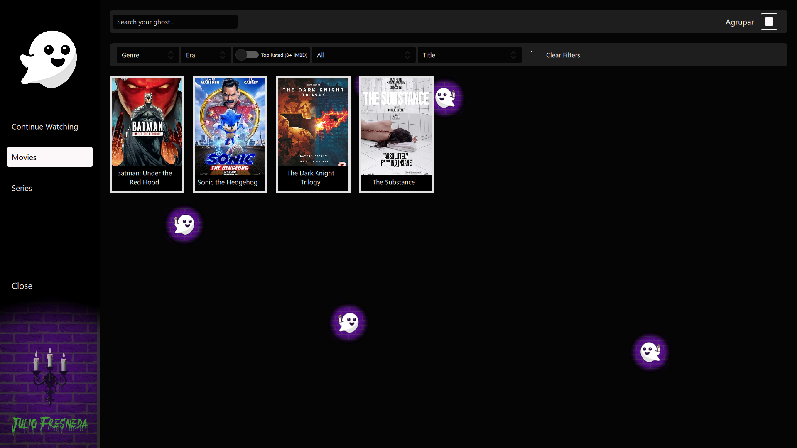
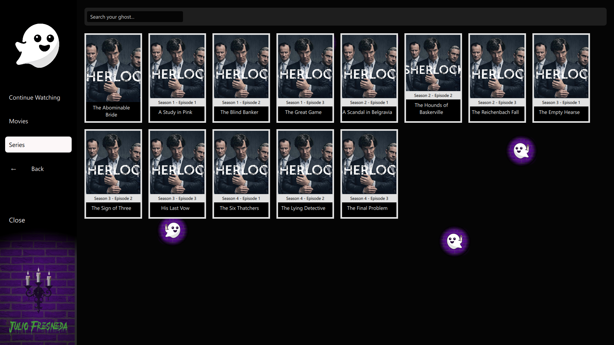
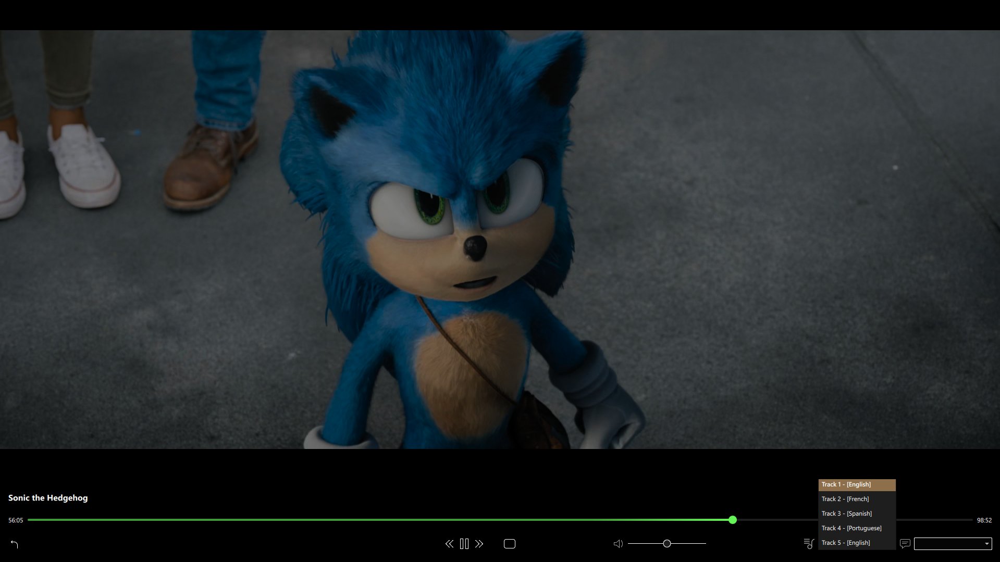

# Don't be scared! Some ghosts are cute.

This project was born out of a collapse of motivations within myself. I always thought it would be cool as hell to have a private "Netflix" app where no movie or series is ever removed, and everything I want is always available. My future son will not watch any fucking Disney Channel cartoons; instead, he will watch Goten being completely beaten the shit out of  by Cell, which is, of course, much healthier content for a kid.

I also love C++. I hate Qt, but love C++. I'm tired of Python, so I thought it would be cool to code this app in a language so efficient that even my Airfryer could run it.

Anyway, I'm tired of writing, so check out this documentation done by ChatGPT. The code comments were also written by Claude. Pinky promise, very little of the code has been done with AI—just the specific stuff. Not because I wouldn’t like to, but because AI isn’t intelligent enough to comply with my dictatorial demands for building this app.

---

## Repository Overview

### [GhostServer](https://github.com/JulioFresneda/GhostServer)

The backend powerhouse of the GhostStream ecosystem. GhostServer handles:

- Dynamic Adaptive Streaming over HTTP (DASH) for smooth and scalable video playback.
- Real-time IP synchronization using DuckDNS for dynamic DNS (DDNS) support, ensuring clients always connect to the latest public IP.
- Multiple audio and subtitle track compatibility for a tailored viewing experience.

### [GhostClient](https://github.com/JulioFresneda/GhostClient)

The sleek frontend application designed for media playback and navigation. Key features include:

- Automatic retrieval of media metadata and cover art from IMDb.
- Seamless connection to GhostServer for live and on-demand playback.
- Built-in compatibility with Android TV, with additional builds required for deployment.

> **Note:** While AI was employed to generate insightful code comments and assist in specific areas, the majority of the code was lovingly hand-coded to ensure precision and functionality.

---

## How It Works

### Client-Server Architecture

GhostStream operates on a robust client-server model:

1. **Server Setup**: Run GhostServer on any machine to host your media library. It handles all streaming logic and makes media accessible via DASH.
2. **Client Connection**: GhostClient connects to the server, fetching media libraries and streaming content with ultra-low latency.

With DuckDNS integration, the server’s public IP is dynamically updated, allowing clients to reliably connect even when the IP changes.

---

## Key Features

### DASH Streaming

GhostStream leverages **Dynamic Adaptive Streaming over HTTP (DASH)** to:

- Provide adaptive bitrate streaming for smooth playback regardless of network conditions.
- Deliver high-quality video with minimal buffering.

### LibVLC Integration

Using **LibVLC**, GhostStream ensures:

- Compatibility with multiple media formats.
- Seamless playback of videos with multiple audio and subtitle channels, allowing users to switch tracks on the fly.

### Metadata Automation

The client app automatically fetches metadata like:

- Movie covers
- Descriptions
- Ratings

This information is pulled directly from IMDb, ensuring accuracy and a polished interface.

### Android TV Compatibility

GhostClient is fully compatible with Android TV. However, an **Android build** is necessary for deployment.

---

## Screenshots

Experience the sleek UI of GhostStream:

### Login Screen

### Navigation View 1

### Navigation View 2

### Player Screen

---

## Getting Started

### Setting Up GhostServer

1. Run the daemon (executable).
2. Configure DuckDNS for DDNS support (optional but recommended).
3. Add media with tools provided!

### Running GhostClient

1. Run the executable.
2. Make an user in the server, add the password to the .ini file.
3. Enjoy!

---

We hope you enjoy using GhostStream as much as I enjoyed creating it. For questions or contributions, check out the respective repositories and let’s keep improving this project together!

